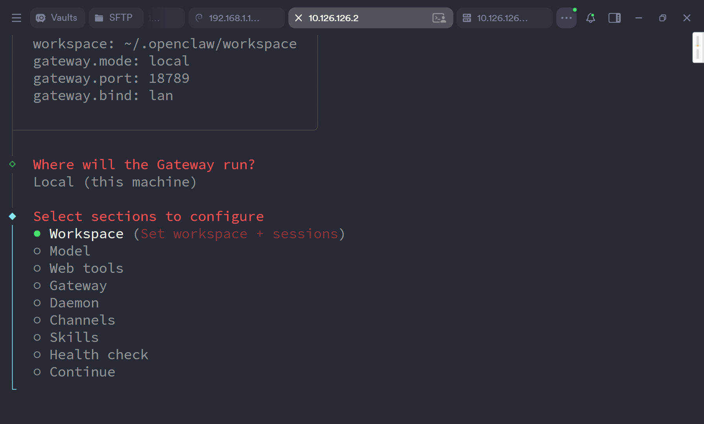
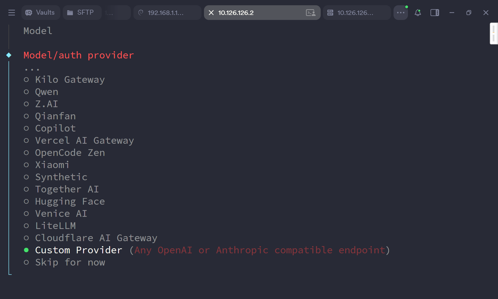
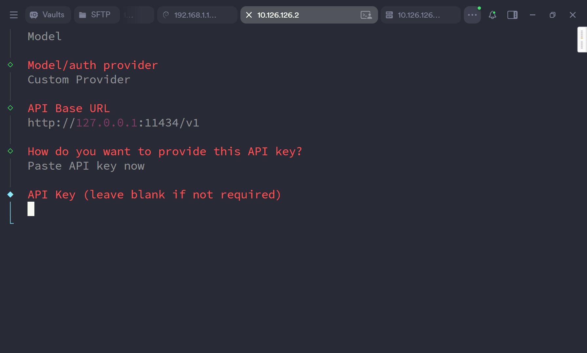
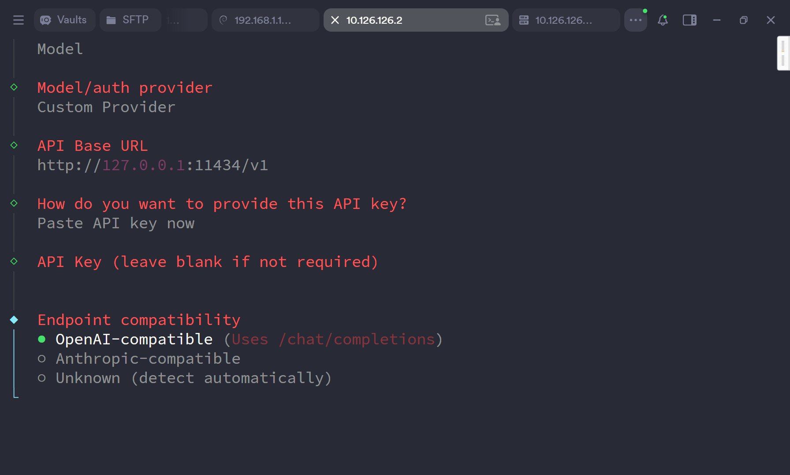
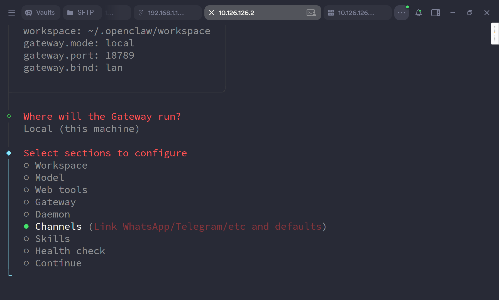
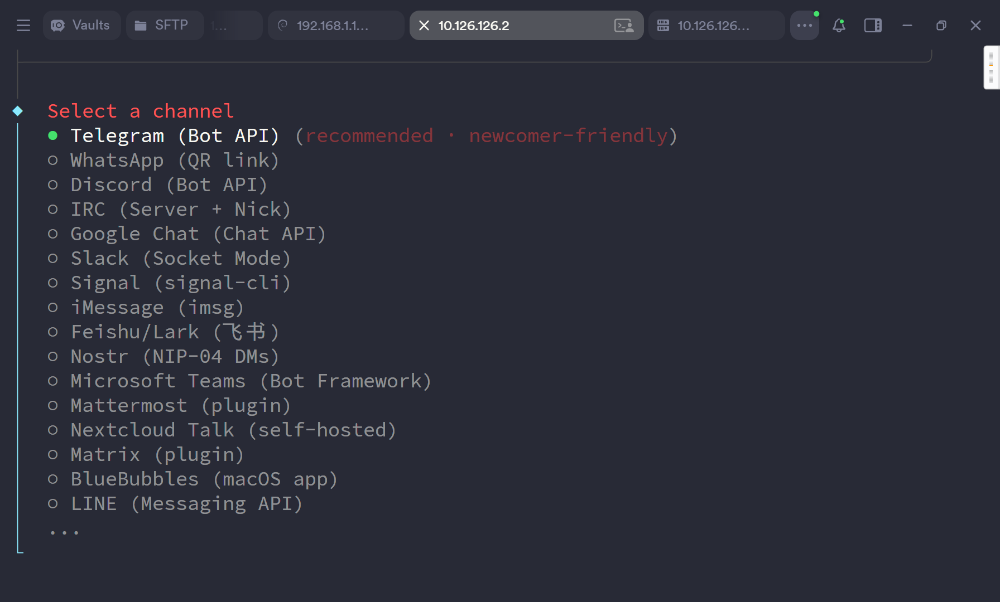

进入容器终端

执行 node /app/dist/index.js config

-> local

-> model

-> custom provider

输入 baseurl

输入apikey

选择api格式 一般openai格式如果是codingplan为authropic格式

输入你想使用的modelid，不止一个用,分隔

-> channel

选择你的channel，填入对应凭证即可

访问https://ip:18789?token=casaos

如果出现paired required

则再次进入容器终端

执行node /app/dist/index.js devices list

如果出现未配对设备

执行node /app/dist/index.js devices approve <request_id>