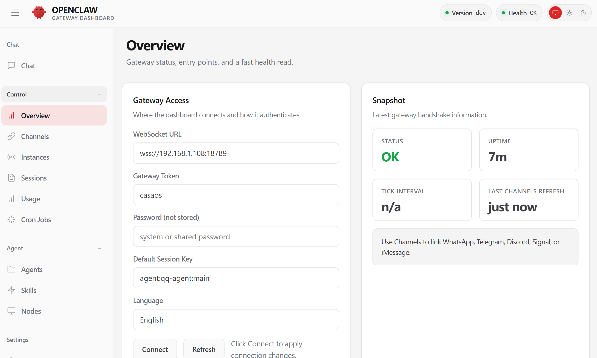
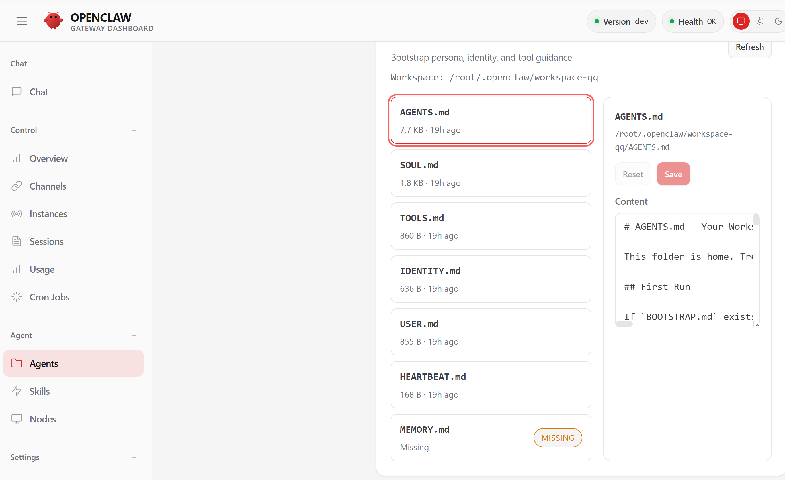
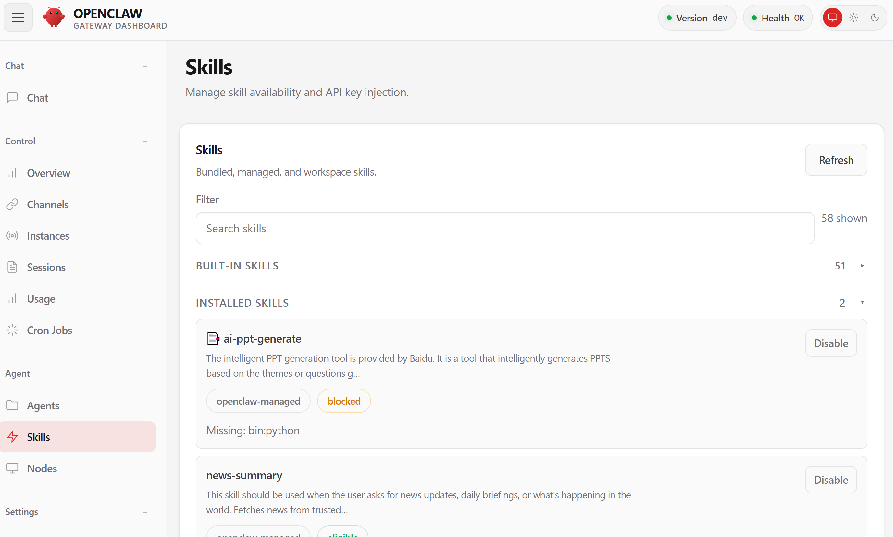

# OpenClaw 配置指引

## 1. 进入容器并启动配置向导

1. ssh连接zimaos后命令行进入容器：
```bash
docker exec -it openclaw bash
```

2. 在容器终端执行：

```bash
node /app/dist/index.js config
```


3. 按提示在 `Where will the Gateway run?` 选择 `Local (this machine)`。

## 2. 配置模型提供方（Provider）
1. 在 `Select sections to configure` 中进入 `Model`  


2. 在 `Model/auth provider` 中选择 `custom provider`  


## 3. 填写模型参数
1. 输入 `baseurl`  


2. 输入 `apikey`  


3. 选择 API 格式（一般选择 OpenAI；如果是 CodingPlan，选择 Anthropic）  


4. 输入你要使用的 `model id`（多个模型可用英文逗号 `,` 分隔）  


## 4. 配置消息通道（Channel）
1. 在 `Select sections to configure` 中选择 `Channels`  


2. 选择你的 channel  


3. 填入对应凭证

### Telegram 示例
1. 在 Telegram 中与 `@BotFather` 对话，发送 `/newbot` 创建 bot，并获取 `bot token`  


2. 在配置中填入 `bot token`  


3. 当系统询问 `Configure DM access policies now? (default: pairing)` 时，选择 `Yes`，默认使用配对模式。  


4. 在 `Telegram DM policy` 中选择 `Pairing (recommended)`。  


5. 返回 `Select sections to configure` 后，选择 `Continue (Done)` 完成 Telegram 配置。  


6. 完成上述设置后，在终端执行以下命令，将 `openclaw` 与你的 Bot 绑定：

```bash
openclaw pairing approve telegram <你的配对码>
```

将命令中的 `<你的配对码>` 替换为 Telegram 中显示的配对码，看到成功提示即表示配对完成。

## 5. 访问服务
配置完成后访问：

```text
https://<ip>:24190?token=casaos
```

## 6. 出现 `paired required` 时的处理
再次进入容器终端，执行：

```bash
node /app/dist/index.js devices list
```

如果出现未配对设备，执行：

```bash
node /app/dist/index.js devices approve <request_id>
```
