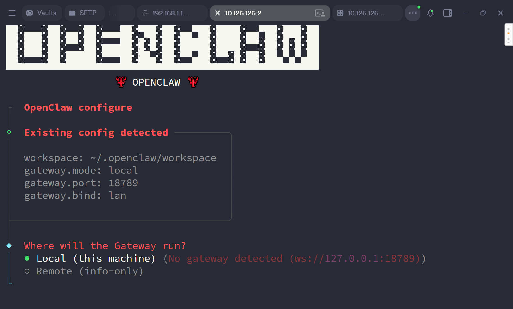
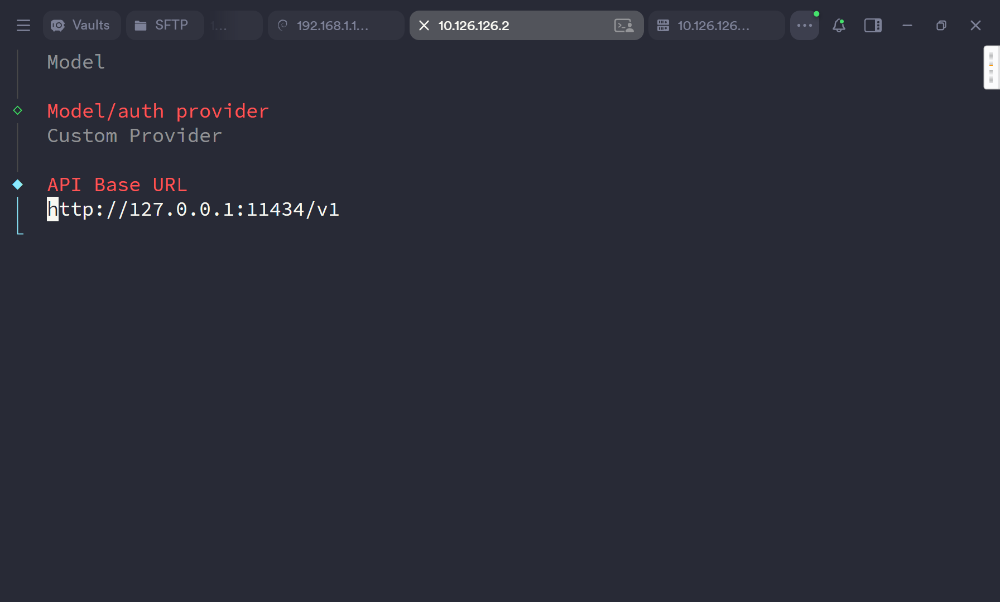
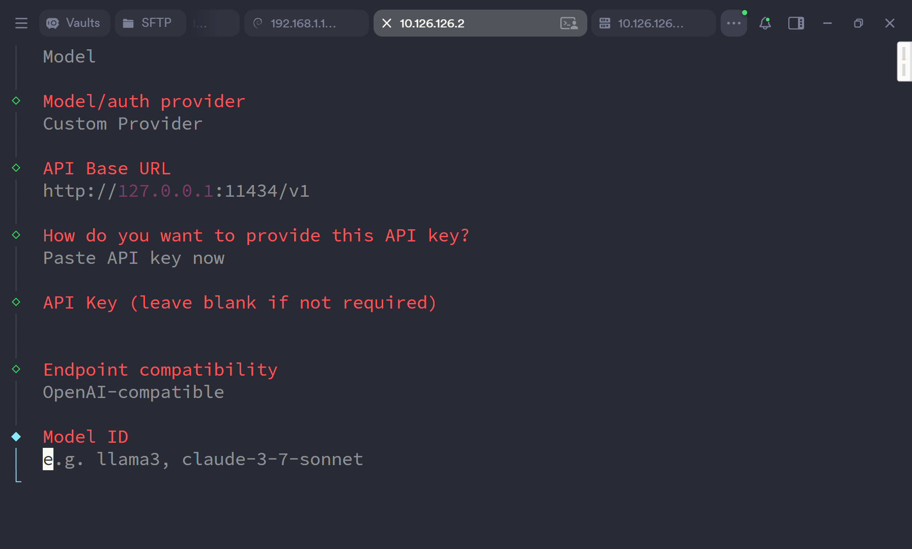
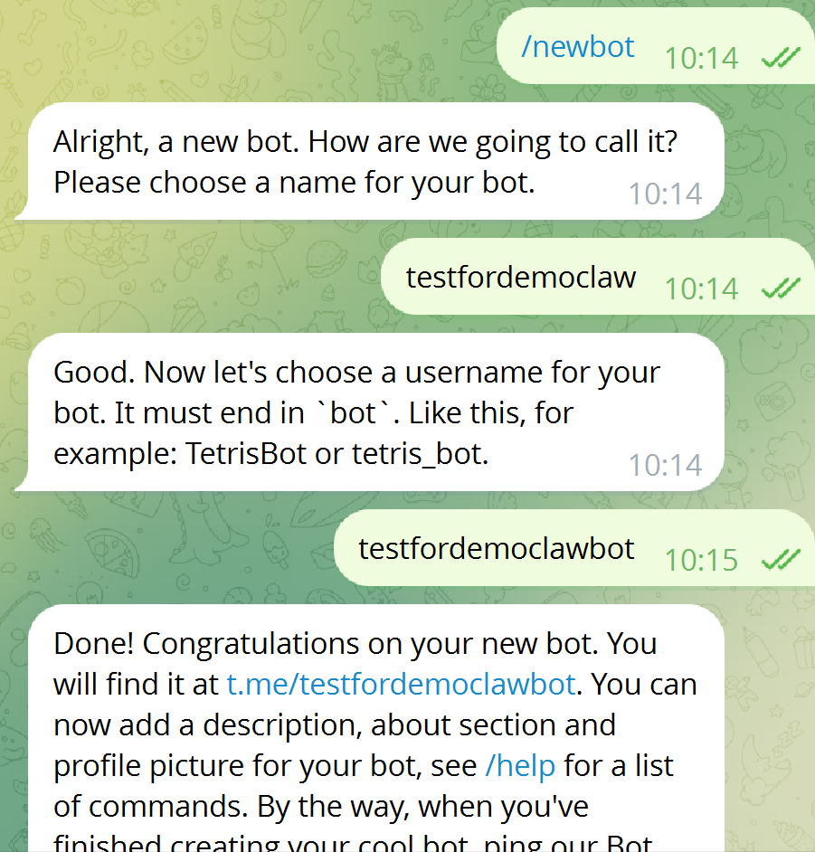
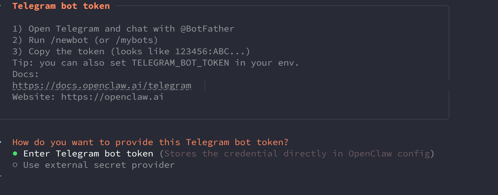
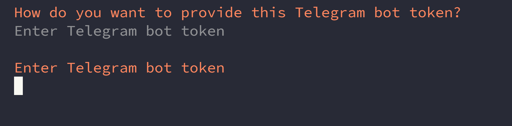

# OpenClaw 配置指引

## 1. 进入容器并启动配置向导
在容器终端执行：

```bash
node /app/dist/index.js config
```



## 2. 配置模型提供方（Provider）
1. 选择 `local`  


2. 选择 `model`  


3. 选择 `custom provider`  


## 3. 填写模型参数
1. 输入 `baseurl`  


2. 输入 `apikey`  


3. 选择 API 格式（一般选择 OpenAI；如果是 CodingPlan，选择 Anthropic）  


4. 输入你要使用的 `model id`（多个模型可用英文逗号 `,` 分隔）  


## 4. 配置消息通道（Channel）
1. 选择 `channel`  


2. 选择你的 channel，并填入对应凭证

### Telegram 示例
1. 在 Telegram 中与 `@BotFather` 对话，发送 `/newbot` 创建 bot，并获取 `bot token`  


2. 在配置中填入 `bot token`  



## 5. 访问服务
配置完成后访问：

```text
https://<ip>:18789?token=casaos
```

## 6. 出现 `paired required` 时的处理
再次进入容器终端，执行：

```bash
node /app/dist/index.js devices list
```

如果出现未配对设备，执行：

```bash
node /app/dist/index.js devices approve <request_id>
```
